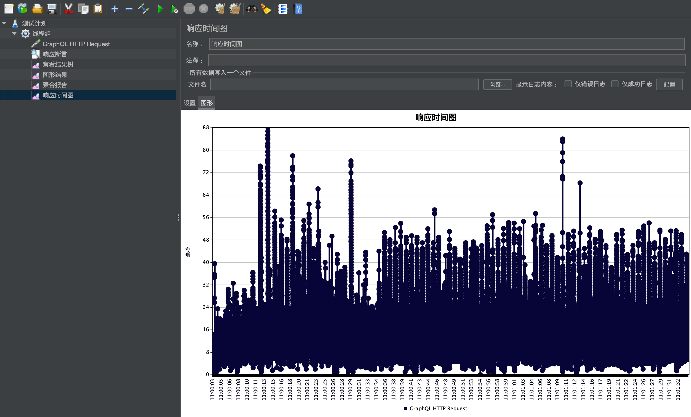
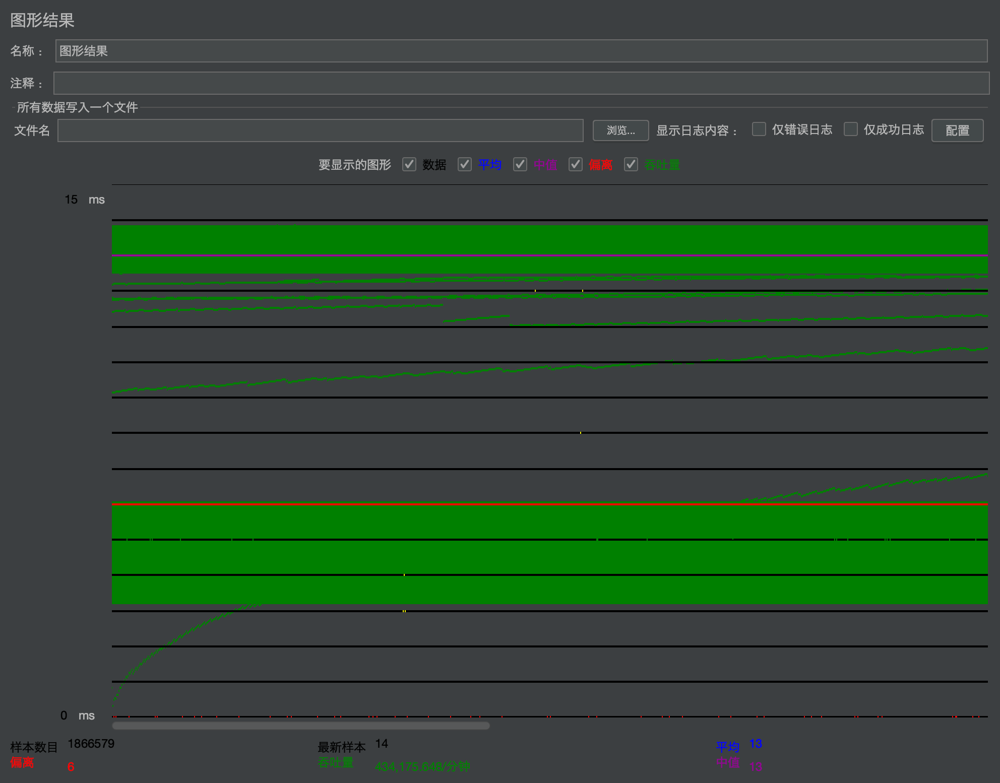

# little vote
## 类
* 票据管理
    
    TicketManager用来管理当前有效票务；
    
    remainID.txt文件给当前有效票据信息做灾备,服务器再次启动时从中读取票面和剩余次数;
    
    当前票据有效次数设置静态全局变量记录,提高访问效率;
    
    当前有效票据信息利用AES加密传输，服务端报错密钥;
    
* 票

    ```
    public class ticket{
        private String time;//票面
    }
    ```
 * 候选人
    ```
    public class Person {
        private Integer id;
        private String username;
        private Integer voteNums;
        private Integer version; //乐观锁
    }
    ```
 
## 接口
URL:`http://127.0.0.1:8080/little_vote`
* 查询
```
query{
    personByUsername(username:"Bob"){
        id
        username
        voteNums
        version
    }
}
```

* 投票
```
mutation{
    vote(vote:{
        selectedPersons:["Bob","Alex","小林","小林","小林"],
        ticket:{time:"9cNPhFaMDeA6JrLNu1iq6Q=="}
        }){
        msg
        status
    }
}
```

* 获取当前票据
```
query{
    getCas{
        msg
        sta
    }
}
```

## 并发
1) 数据库并发
    * InnoDB引擎自带的锁机制
    * 乐观锁
    ```
    update persons set voteNums = #{voteNums,jdbcType=INTEGER}+1, version = version + 1 where id =#{id,jdbcType=INTEGER} and version = #{version,jdbcType=INTEGER}
   ```
2) 逻辑并发
    -[ ] 加入redis缓存，查询先到缓存中查询，若不存在则去数据库中查询；更新时，删除缓存中的对应数据
3) druid数据库池配置
4）cache对应配置
    

## 异常处理
-[ ] 输入数据的判断，包括候选人是否存在的检测等(对输入类型未做校验，输入验证错误如何返回待处理)
-[ ] 实现GraphQLErrorHandler接口

## 性能测试
1） postman接口测试(串行)

    | 接口  | 查询   | 投票  |获取当前票据|
    |---|---|---|---|
    |  响应时间 |  8ms | 126ms  |16ms|
2) jmeter
    * 查询票据信息
        * 响应时间
       
       * 图形结果
       
    